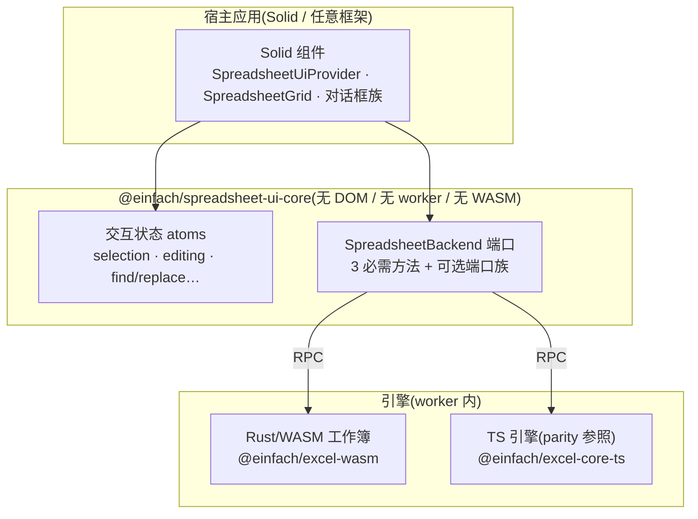
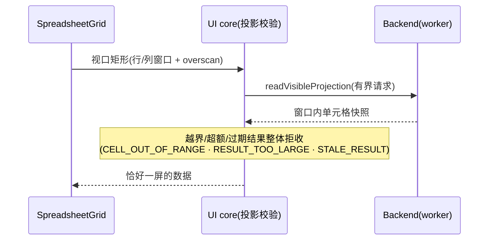
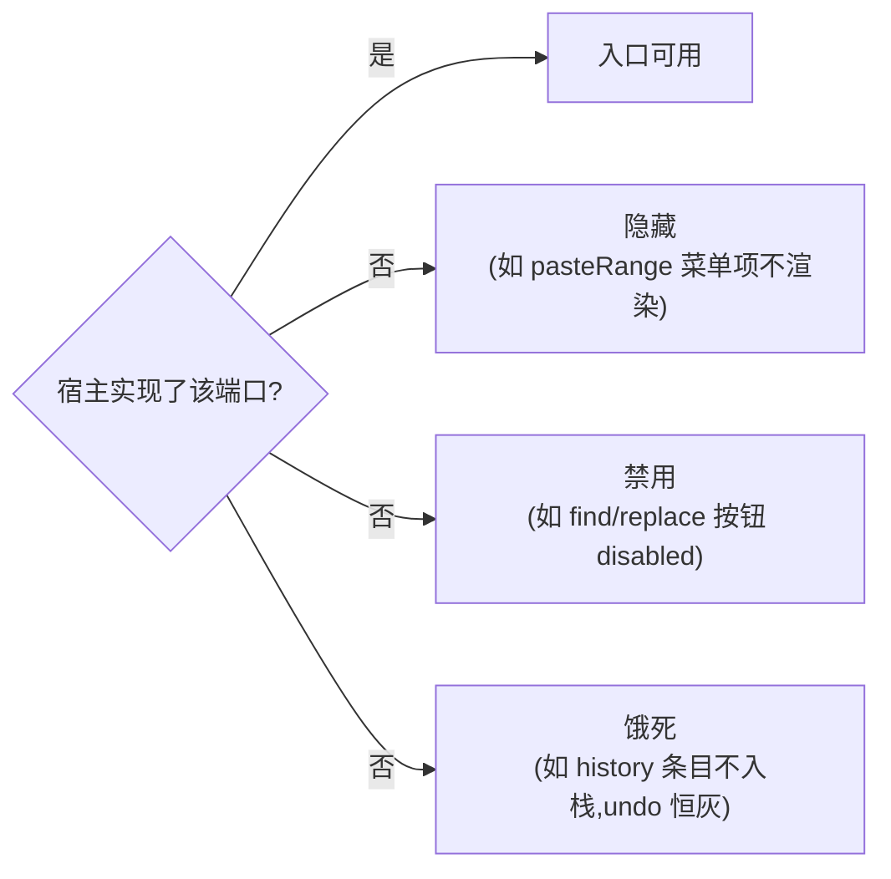

# 架构图素材（AD-605）

可复用于文章与站点的三层分层与 backend port 图。事实来源:`docs/ARCHITECTURE.md`、
`excel/spreadsheet-ui-core/src/backend/types.ts`、CLAUDE.md「Three-tier layering」。

## 图 1:三层分层与依赖方向

## 图 2:可见窗口投影(载荷跟视口,不跟工作簿)

## 图 3:可选端口的三种降级形态

出处见 `docs/BACKEND_DEGRADATION.md` 的逐条代码引证。
