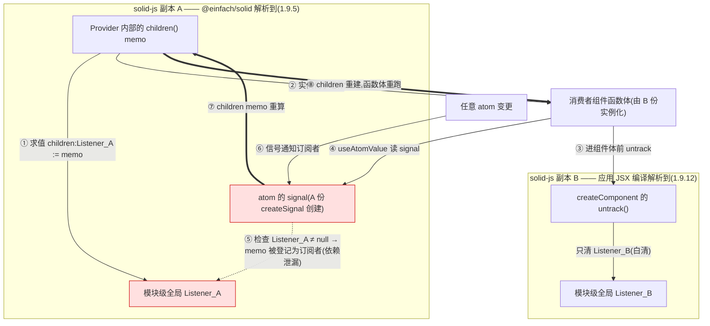
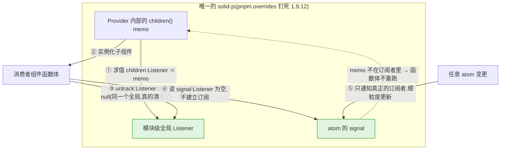
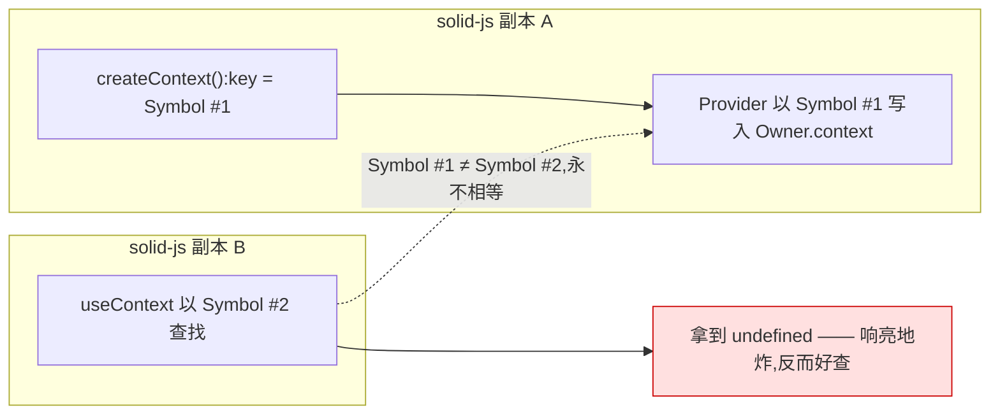

# AD-607 文章一配图(mermaid 源码)

配合 `article1-solid-dual-instance.md`。图 1、图 2 对应正文两处占位;图 0 是备选对照图,正文未引用,视渠道排版决定是否使用。掘金/知乎等不渲染 mermaid 的渠道,用 mermaid CLI(`mmdc`)或 mermaid.live 导出 SVG/PNG 后替换占位。

## 图 1:双副本时的依赖泄漏链路(插入「真相」一节的编号列表之后)

图注:两份 solid-js 各持一个模块级全局 `Listener`。A 份 Provider 的 children memo 求值时占住 `Listener_A`;B 份实例化消费者时 `untrack` 只清得掉 `Listener_B`;消费者读 A 份创建的 signal 时检查的是仍未清空的 `Listener_A`——children memo 就此订阅了消费者的信号,任何 atom 变更都会让整棵 children 重建。

## 图 2:修复后单实例下的正常链路(插入「修复」一节 overrides 代码块之后)

图注:`pnpm.overrides` 把依赖图收敛到唯一一份 solid-js 后,`untrack` 清掉的正是 memo 占住的那个 `Listener`——消费者读 signal 时追踪上下文为空,不建立订阅,children memo 与 atom 变更彻底解耦,函数体只在挂载时执行一次。

## 图 0(备选):教科书式双实例症状——Symbol 对不上,context 查找失败

图注:双实例最常见的形态是 Provider 与 useContext 分属两份实例,`createContext` 各自造的 Symbol 永不相等,消费端拿到 `undefined` 当场报错。本文案例**不是**这个形态(Provider 与 hook 同属一份实例,context 查找成功),此图仅作对照,帮助读者区分"响亮的双实例"与"阴险的双实例"。

## 导出参数建议

- 主题:`default`(浅底),导出时加 `-b transparent` 保透明背景;深浅色渠道各出一份或改用中性灰描边。
- 图 1/图 2 建议宽度 ≥900px 导出,中文标签在默认字号下 720px 会挤行。
- 三张图的红/绿高亮语义:红 = 泄漏参与方,绿 = 正确解耦参与方,导出后请勿混用。
