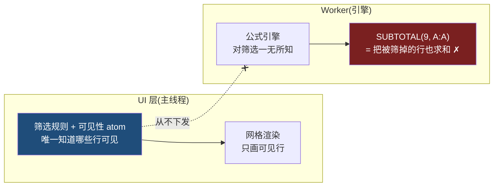
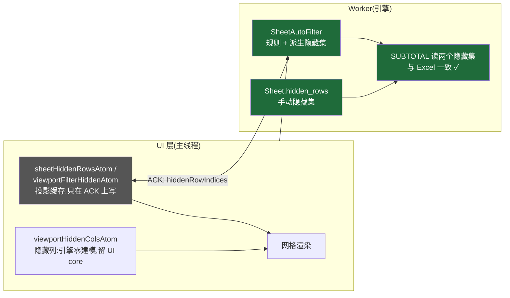
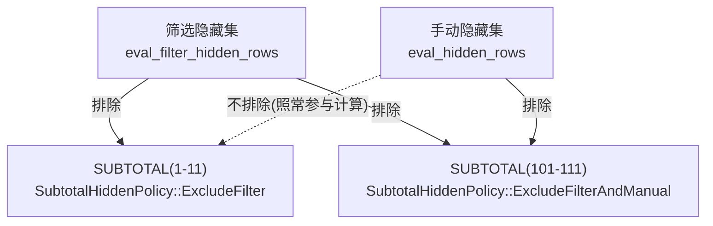
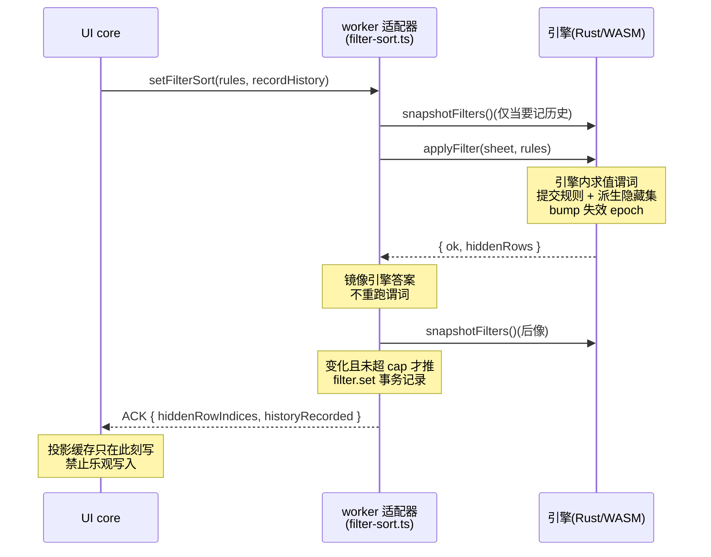

# 文章二配图:状态归属边界前后对比

## 图 1:裁决前——两套真相

筛选可见性只活在 UI 层,引擎按"所有行可见"计算。`SUBTOTAL(1-11)` 把被筛掉的行也加进去,与 Excel 分歧。

## 图 2:裁决后——引擎是唯一权威,UI 只持投影缓存

引擎拥有 `Sheet.hidden_rows` 与 `SheetAutoFilter`(规则 + 派生隐藏集),自己求值谓词;UI atom 降级为只在 backend ACK 上写的投影缓存。隐藏**列**是负对照,留在 UI core。

## 图 3:SUBTOTAL 两档规则——为什么必须两个集合

`SUBTOTAL(1-11)` 包含手动隐藏、排除筛选隐藏;`(101-111)` 两个都排除。集合一旦合并,来源信息丢失,两档规则表达不出来——所以引擎持两个独立集合、两个独立失效 epoch。

## 图 4:applyFilter 一次往返——谁在求值谓词

引擎跑一遍谓词并同时提交规则与隐藏集;适配器只镜像引擎的答案,不重跑谓词;UI core 在 ACK 上写投影缓存。历史记录用引擎快照 `snapshotFilters` 括前后像,超预算时筛选生效但不进历史。

