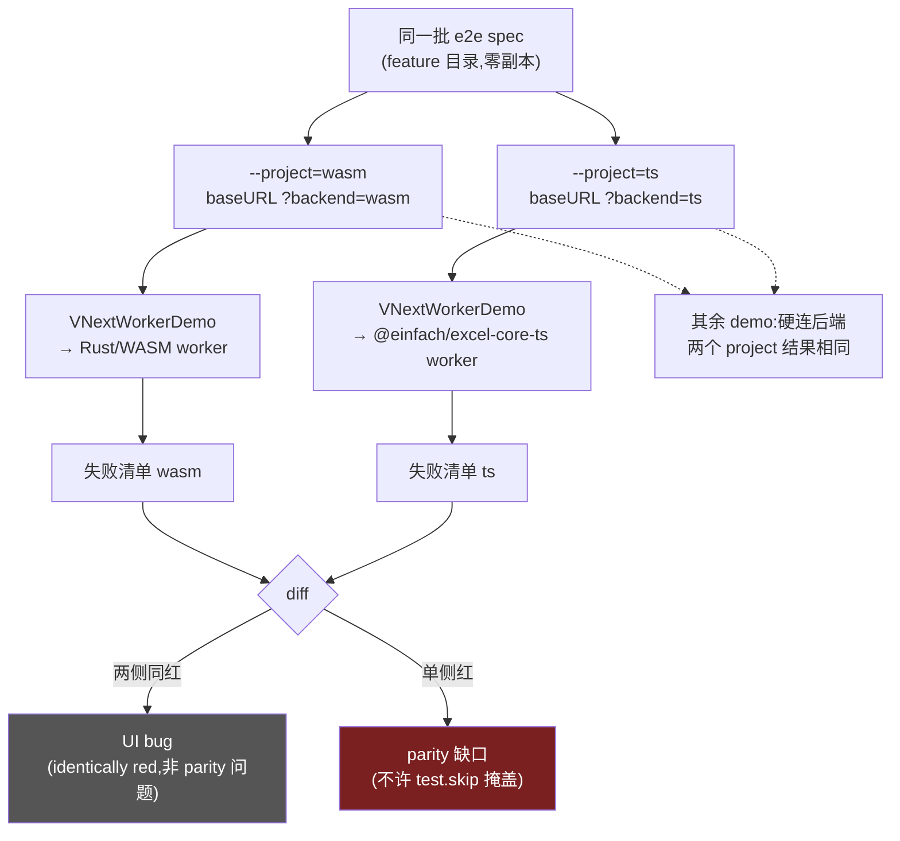
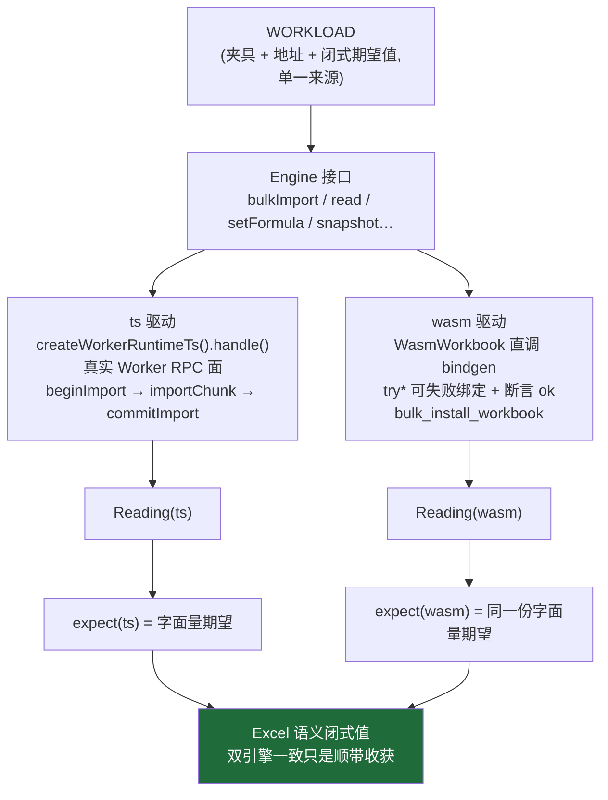
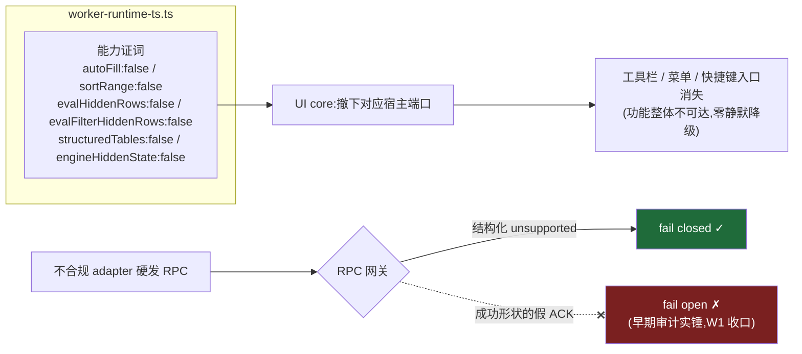
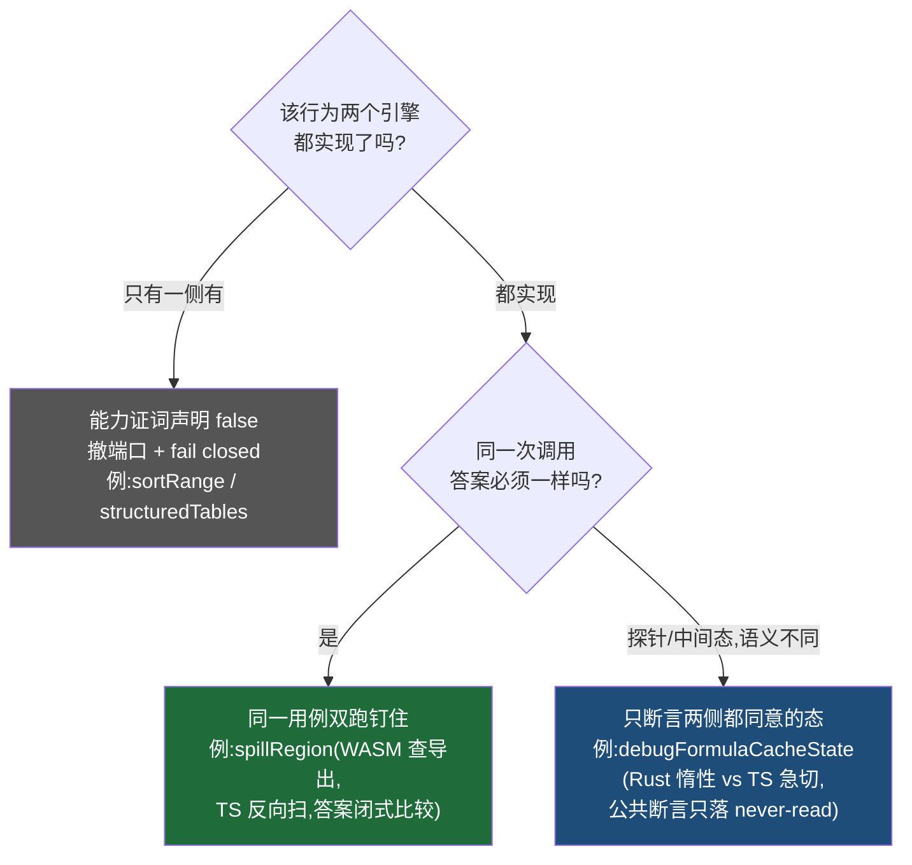

# 文章三配图:同一用例集 → 两个运行时的矩阵

## 图 1:e2e 双 project——同一批 spec,唯一差别是 `?backend=`

Playwright 两个 project 跑逐字相同的 spec 文件;`gotoRoot` 从 project 名自动补 `backend=` 参数;只有 `VNextWorkerDemo` 消费该参数,其余 demo 硬连各自后端(在两个 project 上结果天然相同)。parity 判定 = diff 两份失败清单。

## 图 2:jest 跨引擎驱动面——一个 Engine 接口,两个接入点,字面量期望

场景代码对引擎无感知;TS 走真实 RPC 面,WASM 直调 wasm-bindgen 的可失败 `try*` 绑定;断言字面量而非"两侧相等"(相等证明不了"一起错")。

## 图 3:能力差异 ≠ 分歧——证词、撤端口、fail closed

TS 运行时把缺失能力声明成 `false`;UI core 撤下端口、入口消失;不合规的硬发 RPC 收到结构化 `unsupported`,不是成功形状的假 ACK。差的是功能有没有,不是同一次调用答案一不一样。

## 图 4:三类差异的处置矩阵

