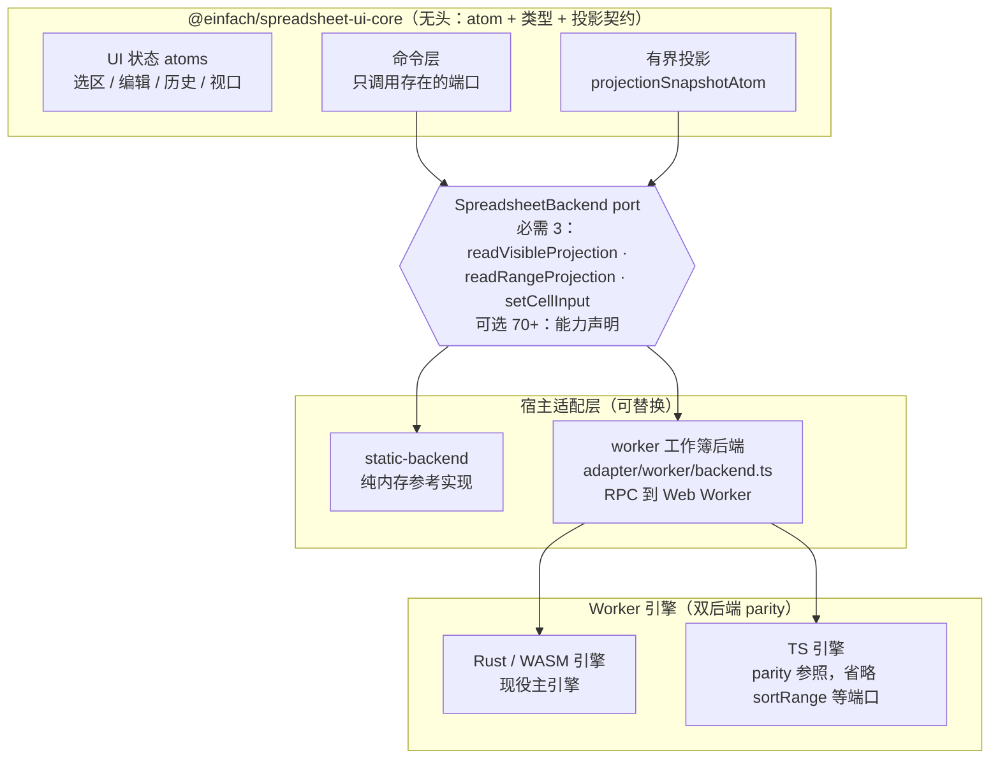
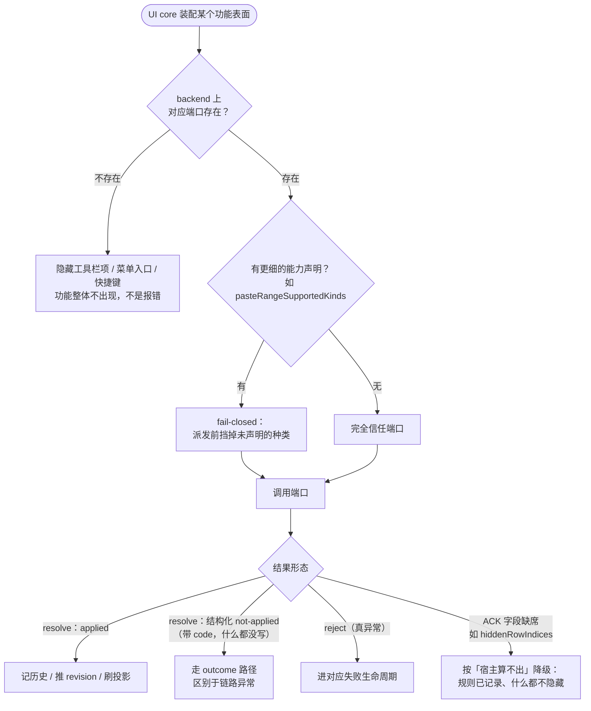
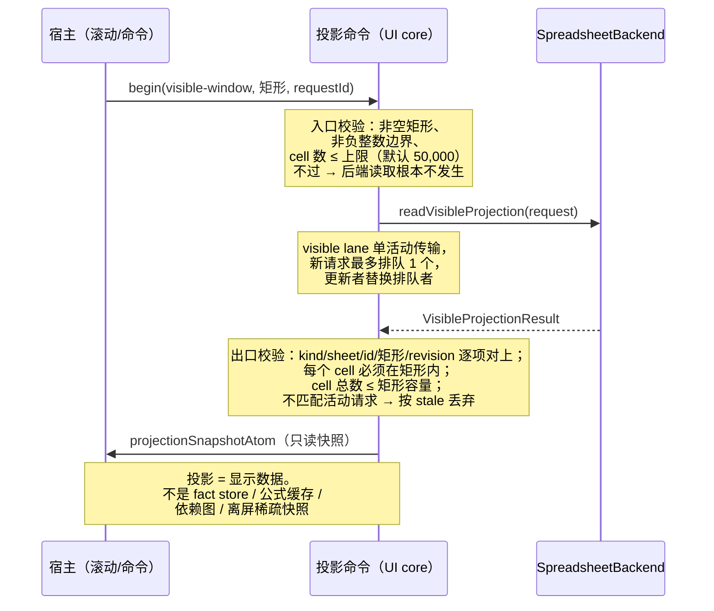
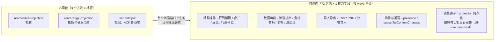

# 文章四配图：三个方法起步的 headless backend port

## 图 1：三层结构与 port 的位置

契约（`SpreadsheetBackend`）是 UI core 对数据源的全部认知；两个参考后端与两套 worker 引擎都实现同一接口。

## 图 2：可选端口的降级判定（degrade without knowing）

UI core 只看「方法在不在」，分不清「宿主没实现」和「功能不存在」——刻意如此。

## 图 3：有界投影的请求生命周期与拒收点

## 图 4：必需面与可选面的构成

