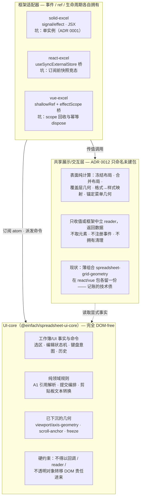
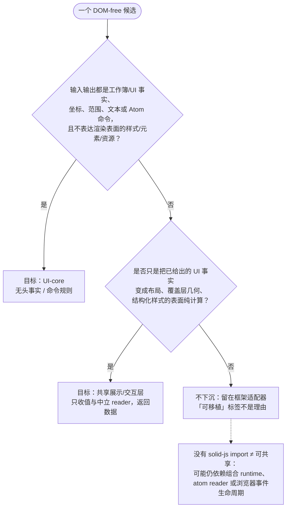
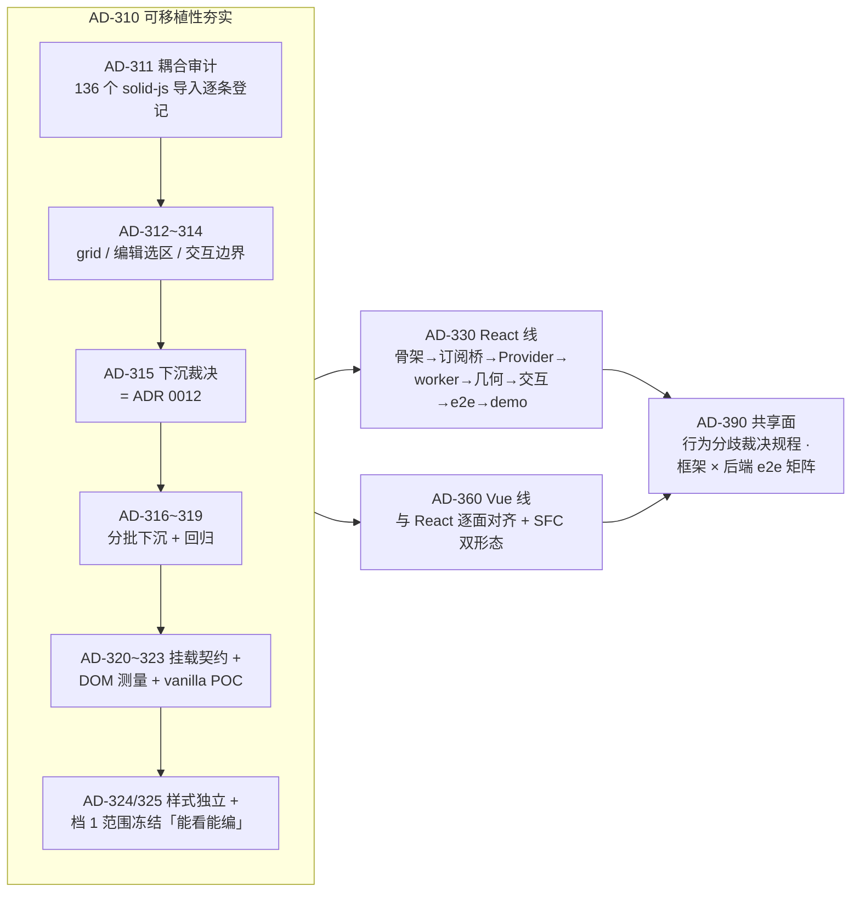
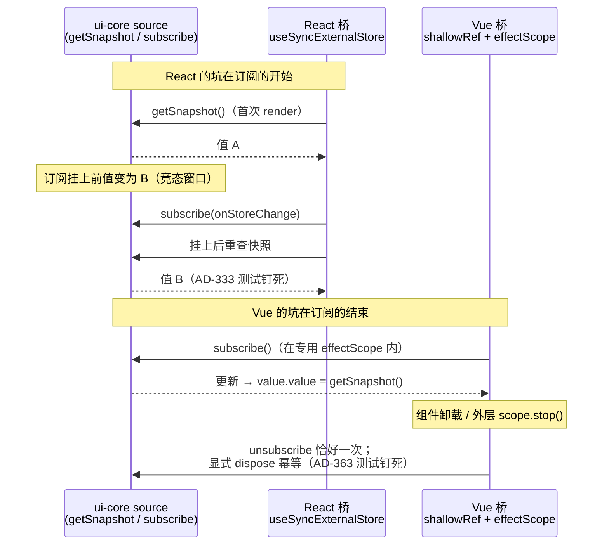

# 文章五配图：给 Solid 库补上 React/Vue 适配层

## 图 1：三层责任划分（核心图）

按 ADR 0012 的裁决：交互事实进 UI-core，表面纯计算归共享展示层（已命名、未建包），事件 / ref / 清理留在各框架适配器。

## 图 2：下沉裁决的两个准入问题（ADR 0012）

## 图 3：真实工序的依赖链（AD-300）

## 图 4：两个订阅桥的并发/回收差异

